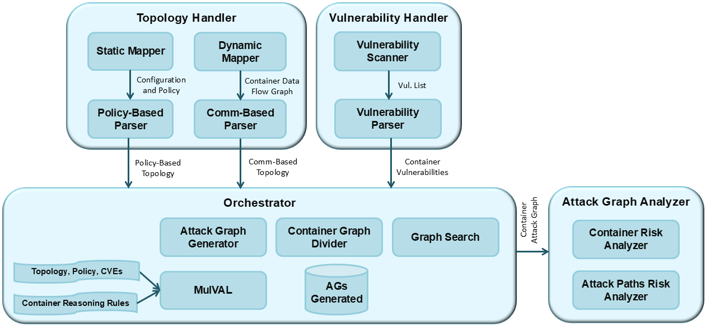

# CORAL: Container Online Risk Assessment with Logical Attack Graphs
CORAL is a framework for continuous risk assessment of containerized environments using logical attack graphs. It efficiently identifies attack paths between containers without requiring graph rebuilding when the underlying architecture changes.

Learn more about CORAL in our published paper: [CORAL: Container Online Risk Assessment with Logical attack graphs](https://kwnsfk27.r.eu-west-1.awstrack.me/L0/https:%2F%2Fauthors.elsevier.com%2Fc%2F1kMqxc43v4Os7/1/0102019423793f90-7424c711-8ad0-4cd6-ab96-a0e6ce5bbf0a-000000/yclPzElDHU4wqmI8CXViq8q8IYI=407)

## Features
* Dynamic risk assessment for container environments using live attack graphs
* Efficient reuse of generated attack graphs through intelligent graph similarity detection
* Attack path risk evaluation model to identify and highlight the riskiest paths
* Support for large-scale container deployments (tested with up to 2,802 pods)
* Integration with Kubernetes environments
* Detection of lateral movement attacks using provenance graphs

## Architecture

CORAL consists of four main modules that work together to provide continuous risk assessment:

 


### 1. Topology Handler
Manages container topology information through two submodules:
* Static Mapper:
  * Scans container configurations and policy files
  * Creates static topology using K8s Python Client
  * Extracts pod information and network policies
  * Generates topology in CSV format with Pod-ID, IP, and Pod-Inbound-List
  * Translates topology into MulVAL facts

* Dynamic Mapper:
  * Monitors real-time communication between pods using [Hubble](https://github.com/cilium/hubble)
  * Creates dynamic topology based on actual container interactions
  * Analyzes topology changes that could affect attack surface
  * Determines when to trigger new attack graph generation
  * Handles pod updates and connection changes

### 2. Vulnerability Handler
* Performs vulnerability scanning using [Trivy](https://trivy.dev/latest/)
* Identifies known vulnerabilities (CVEs) in K8s clusters
* Outputs comprehensive vulnerability data including:
  * Pod identification
  * Software versions
  * CVE IDs
  * Severity levels
  * CVSS scores

### 3. Orchestrator
* Core component managing attack graph generation and optimization
* Implements efficient graph generation through:
  * Division of topology into non-intersecting zones
  * Storage and reuse of generated attack graphs
  * Graph similarity detection using embedding techniques
  * Jaccard similarity coefficient for precise comparison
* Manages database of stored attack graphs
* Determines when to generate new graphs vs reuse existing ones

### 4. Attack Graph Analyzer
* Analyzes generated attack graphs to identify risks and attack paths
* Calculates risk scores for containers and attack paths
* Provides risk prioritization for vulnerability remediation
* Highlights critical attack paths requiring attention
* Integrates with provenance data for lateral movement detection

## Prerequisites

- Python 3.8+
- Kubernetes cluster
- [Trivy vulnerability scanner](https://trivy.dev/latest/)
- [Hubble for monitoring](https://github.com/cilium/hubble)

## Installation

1. Create and activate virtual environment:
```bash
python -m venv venv
source venv/bin/activate  # On Windows: .\venv\Scripts\activate
```

2. Install dependencies:
```bash
pip install -r requirements.txt
```

3. Configure access:
   - Ensure kubectl is configured with cluster access
   - Configure Hubble for container monitoring
   - Set up Trivy for vulnerability scanning

## Directory Structure

```
├── attack_graph_analyzer/     # Attack graph analysis tools
├── docs/                      # Documentation and diagrams
├── orchestrator/              # Core orchestration logic
├── testbed/                   # Testing environment
│   ├── google-microservices-demo/  # Demo application
│   └── microservice_replication/   # Replication framework
├── topology_handler/          # Topology management
├── use_case_example_app/      # Example implementation
└── vulnerability-handler/     # Vulnerability scanning
```

## Getting Started

See individual component READMEs for detailed usage instructions:
- [Attack Graph Analyzer](attack_graph_analyzer/README.md)
- [Topology Handler](topology_handler/README.md)
- [Vulnerability Handler](vulnerability-handler/README.md)
- [Orchestrator](orchestrator/README.md)
- [Use Case Example](use_case_example_app/README.md)
- [Testbed](testbed/README.md)

## Performance

CORAL demonstrates excellent performance for large-scale deployments:
- Graph search is 2 orders of magnitude faster than regeneration
- Processes topologies with thousands of containers efficiently
- Example metrics:
  * 1,402 pods: 206 seconds for AG generation
  * Graph search in 1,000 topologies: 9.5 seconds
  * Net search time: 2.4 seconds (1% of AG generation time)

## Use Cases

CORAL supports various security use cases:
- Continuous risk assessment
- Attack path detection and prioritization
- Vulnerability mitigation planning
- Container loading decision support
- Security tool posture optimization
- Lateral movement detection
- Attack prediction


## Citation

```bibtex
David Tayouri, Omri Sgan Cohen, Inbar Maimon, Dudu Mimran, Yuval Elovici, Asaf Shabtai,
"CORAL: Container Online Risk Assessment with Logical attack graphs,"
Computers & Security, Volume 150, 2025, 104296, ISSN 0167-4048, https://doi.org/10.1016/j.cose.2024.104296.
(https://www.sciencedirect.com/science/article/pii/S0167404824006023)

```

