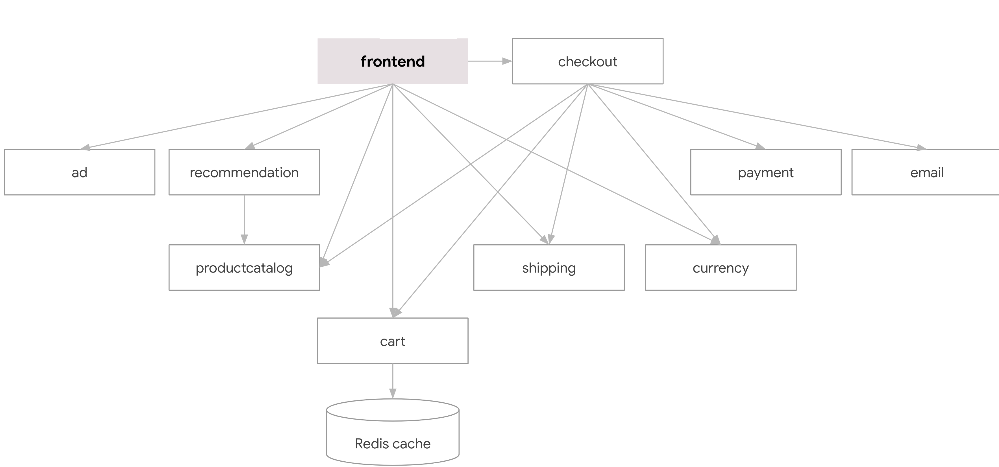

# Replication Framework


## Concept
* Creating a complex application by replicating existing microservices.
* All replicated microservices should function, and be reachable from a frontend.

## Original Application
<a href="https://github.com/GoogleCloudPlatform/microservices-demo" target="_blank">Online Boutique</a>  is a cloud-first microservices demo application. Online Boutique consists of an 11-tier microservices application. The application is a web-based e-commerce app where users can browse items, add them to the cart, and purchase them.

 

## The Framework
### Input
A dictionary describing each microservice, and it’s number of replicas.

```
rep_dict = {'adservice': 6,
            'productcatalogservice': 5,
            'recommendationservice': 6,
            'redis-cart': 1,
            'cartservice': 1,
            'shippingservice': 5,
            'currencyservice': 5,
            'paymentservice': 5,
            'emailservice': 5,
            'checkoutservice': 6,
            'frontend': 7}
```
* In order to make sure every port is reachable from a frontend, we Validate the replications' dictionary so there is no more of a certain “child” microservice than its "parent" microservice.
* Many parents can use the same child, but each parent uses exactly one child.

### Output
yaml files matching the replicated application, the files can be applied to a kubernetes cluster to run the new application.

### What does replication means?
* Creating a new Kubernetes Service, Deployment and Network Policy.
* All replicated services have the same docker image, but the environment variables are different, such as: 
  - port
  - service name
  - address
  - children addresses
* We can’t replicate microservices who doesn’t reveal those environments variables- redis and cart service.

## Example
### Input
```
rep_dict = {'adservice': 1,
            'productcatalogservice': 1,
            'recommendationservice': 1,
            'redis-cart': 1,
            'cartservice': 1,
            'shippingservice': 1,
            'currencyservice': 1,
            'paymentservice': 1,
            'emailservice': 1,
            'checkoutservice': 1,
            'frontend': 2}
```
###  Output
yamls files for the replicated application, which depict the following architecture:

 
